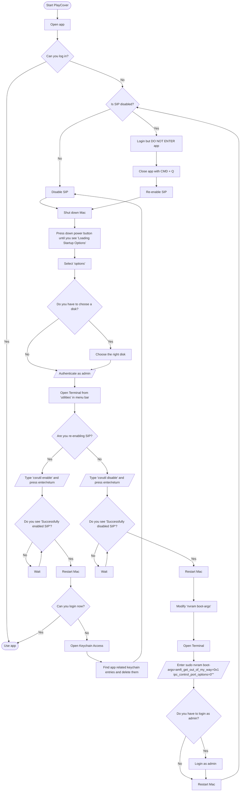

# PlayCoverDocs

Flow chart for troubleshooting app login issues and stuff

## Overall process

```mermaid
flowchart TB
start([Start PlayCover]) --> open[Open app]
open --> loginCheck{Can you log in?}
loginCheck -- Yes --> noProblem([Use app])
loginCheck -- No --> disableSIPCheck{Is SIP disabled?}
disableSIPCheck -- No --> SIPDisable[Disable SIP]
SIPDisable --> shutdownMac[Shut down Mac]
disableSIPCheck -- Yes --> disabledSIP[Login but DO NOT ENTER app]
shutdownMac --> pressHold[Press down power button until you see 'Loading Startup Options']
pressHold --> selectOptions[Select 'options']
selectOptions --> diskCheck{Do you have to choose a disk?}
diskCheck -- Yes --> chooseDisk[Choose the right disk]
diskCheck -- No --> adminAuth[/Authenticate as admin/]
chooseDisk --> adminAuth
adminAuth --> utilTerminal[Open Terminal from 'utilities' in menu bar]
utilTerminal --> checkSIP{Are you re-enabling SIP?}
checkSIP -- Yes --> cmdEnable[/Type 'csrutil enable' and press enter/return/]
cmdEnable --> enableCheck{Do you see 'Successfully enabled SIP'?}
enableCheck -- Yes --> enableReboot[Restart Mac]
enableReboot --> postSIPCheck{Can you login now?}
postSIPCheck -- Yes --> noProblem
postSIPCheck -- No --> openKeychain[Open Keychain Access]
openKeychain --> keychainSearch[Find app related keychain entries and delete them]
keychainSearch --> SIPDisable
enableCheck -- No --> enableWait[Wait]
enableWait --> enableCheck
checkSIP -- No --> cmdDisable[/Type 'csrutil disable' and press enter/return/]
cmdDisable --> disableCheck{Do you see 'Successfully disabled SIP'?}
disableCheck -- Yes --> disableReboot[Restart Mac]
disableCheck -- No --> Wait
Wait --> disableCheck
disableReboot --> modifyBootArgs[Modify 'nvram boot-args']
modifyBootArgs --> openTerminal[Open Terminal]
openTerminal --> cmdTerminal[/"Enter sudo nvram boot-args="amfi_get_out_of_my_way=0x1 ipc_control_port_options=0""/]
cmdTerminal --> authTerminal{Do you have to login as admin?}
authTerminal -- Yes --> enterPassword[Login as admin]
authTerminal -- No --> bootArgsReboot[Restart Mac]
enterPassword --> bootArgsReboot
bootArgsReboot --> disableSIPCheck
disabledSIP --> closeApp[Close app with CMD + Q]
closeApp --> enableSIP[Re-enable SIP]
enableSIP --> shutdownMac
```

## After app update 
```mermaid
```
## After macOS update
```mermaid
```
